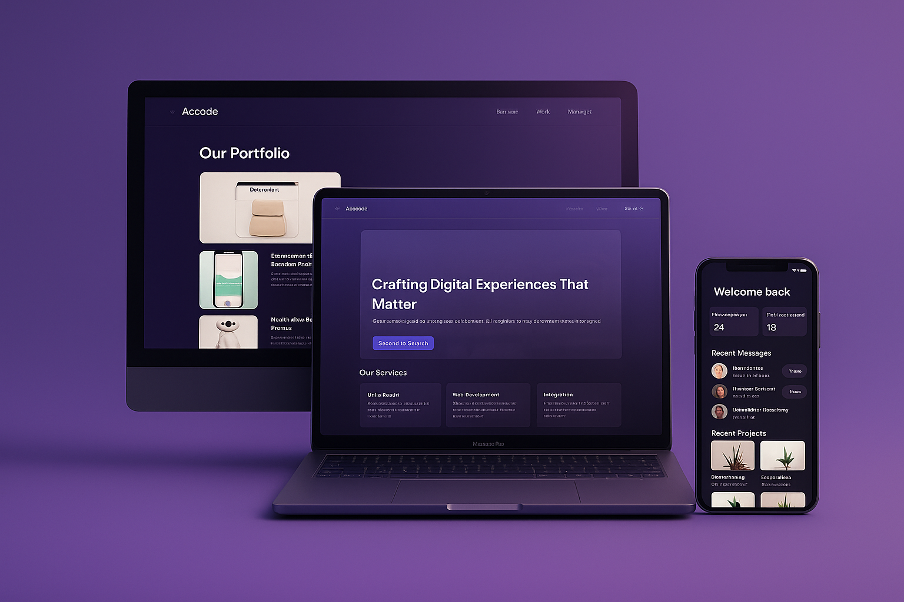

# Arcodé — UI/UX Design for Website & Admin Dashboard

This repository contains the visual design files for **Arcodé**, a digital product studio website.  
It includes a marketing website and a powerful admin dashboard interface.

## 📌 Project Overview
Arcodé’s design focuses on clarity, storytelling, and seamless UX for both visitors and admins.

## 📁 Folder Structure
- `/assets/mockups/` – Mockup images
- `/assets/screens/website/` – Screens from the website
- `/assets/screens/dashboard/` – Admin dashboard screens

## ✨ Key Features
- Website with Pricing, Consultation, and Service Overview
- About, Contact, and Portfolio Sections
- Admin Dashboard with:
  - Project Management
  - Team Management
  - Role-based Access
  - Activity Logs
  - Custom Settings

## 🧰 Tools Used
- Figma (Design & Prototyping)
- Google Fonts (Space Grotesk for Typography)

## 📷 Preview

## 📎 Behance Link
[View Full Project on Behance](https://www.behance.net/gallery/227695387/Arcod-UIUX-Design-for-Website-Dashboard)
